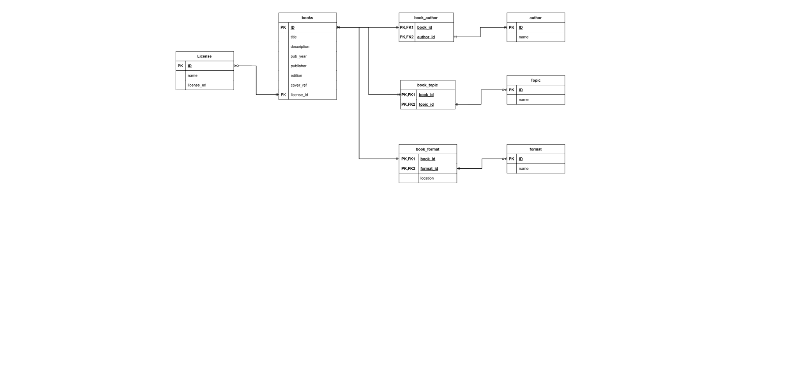

# BookPadi Architecture
An explanation or walkthrough of how I came about the data model for bookpadi's MVP

## User Flow
For the MVP, I wanted the application to simply provide a searchable library of openly licensed books, which meant that the backend would need to support the following four operations at minimum:

1. Browse available books
2. Search for books
3. View the details of a selected book
4. Reading a book

## Data requirements
The next step was to trace the operations to see what data each operation required.

1. **Browsing and Searching**: The backend needs data that can be queried and filtered.
2. **Details page**: Needs more information about the selected book
3. **Reading a book**: The actual book file

I then decided it was best to store only information that describes a book in the DB and store the actual files separately.

## Categories of Data
I listed out all possible data that might be needed and grouped them into three categories

### PostgreSQL
All the information the apps will need to successfully query, filter, search and display books

1. Book title
2. Description
3. Publication information: Publication year, Publisher, Edition
4. Author
5. Topic
6. License
7. Formats available to read
8. Location of books
9. Location of cover images

### Book files
The actual book files. Only the location of these files is stored in PostgreSQL

### Cover Images

The image files are stored separately. Only the location of each image is stored in PostgreSQL

## Structuring the Data in PostgreSQL

After I established the data requirements, the next thing I had to figure out was how to organise that information in PostgreSQL.
I started with how to organise the data that describes a book, since it is the central entity the MVP is built around.

### Book

Primary database entity.

Its columns are:

| Column | Type | Constraints |
| --- | --- | --- |
| `id` | `bigint` | primary key, generated always as identity |
| `title` | `text` | not null |
| `description` | `text` | nullable |
| `language` | `text` | not null, a 2 or 3 character code |
| `pub_year` | `int` | nullable, between 1 and 2100 |
| `publisher` | `text` | nullable |
| `edition` | `text` | nullable |
| `cover_ref` | `text` | nullable |
| `license_id` | `bigint` | not null, references `license (id)` |

### Author

I modeled an author as a separate entity because an author is a distinct piece of data that can be associated with multiple books and a book can have multiple authors

described by:

| Column | Type | Constraints |
| --- | --- | --- |
| `id` | `bigint` | primary key, generated always as identity |
| `name` | `text` | not null, unique |

### Topic
A topic is the subject area that a book can belong to.

contains:

| Column | Type | Constraints |
| --- | --- | --- |
| `id` | `bigint` | primary key, generated always as identity |
| `name` | `text` | not null, unique |

many-to-many relationship with books.

### License
Represents the license under which a book is made available.

| Column | Type | Constraints |
| --- | --- | --- |
| `id` | `bigint` | primary key, generated always as identity |
| `name` | `text` | not null, unique |
| `license_url` | `text` | not null |

### Format
Represents the available formats of a book

| Column | Type | Constraints |
| --- | --- | --- |
| `id` | `bigint` | primary key, generated always as identity |
| `name` | `text` | not null, unique |

### Location
Where a book can be accessed.

I first considered storing the location as its own entity with a one-to-many relationship to books but I realized  that more information will be needed to know what format is stored in that location. Availability depends on the specific format, so storing the location properly means I have to relate three things: the book, the format and the location such that a row contains information to say "this book, in this format, is here".

described by:

| Column | Type | Constraints |
| --- | --- | --- |
| `book_id` | `bigint` | primary key with `format_id`, references `books (id)` |
| `format_id` | `bigint` | primary key with `book_id`, references `format (id)` |
| `location` | `text` | not null |

This entity doubles as the junction between books and formats carrying the location of the book in each format

### Junction tables

`book_author` and `book_topic` are the remaining many-to-many links. Each on has two `bigint` columns both not null, both foreign keys, they both also form a composite PK: `book_author (book_id, author_id)` and `book_topic (book_id, topic_id)`.

## Defining the relationships
I defined the relationship between the entities by asking two questions:
1. For one record of this entity, what is the minimum number of records of the other entity it must be associated with? to determine whether the relationship is optional
2. For one record of this entity, what is the maximum number of records of the other entity it can be associated with? to determine whether it is one or many.

Applying those two questions to each relationship gave:

| Relationship | Book to entity | Entity to book |
| --- | --- | --- |
| Book and Author | a book must have at least one author | an author must have at least one book association |
| Book and License | a book must have just one license | a license can exist without any book association |
| Book and Format | a book must have at least one format | a format can exist without any book association |
| Book and Topic | a book must have at least one topic | a topic can exist without any book association |

[Read More](./attachments/Walktrough%20BookPadi%20MVP%20Architecture.pdf)
